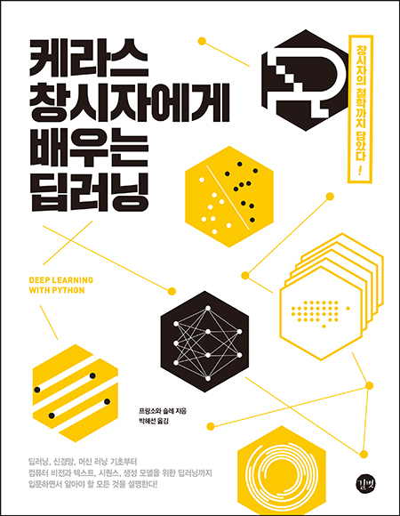

# Deep Learing With Python

[케라스 창시자에게 배우는 딥러닝](https://tensorflow.blog/케라스-창시자에게-배우는-딥러닝/) 공부 및 예제 정리

## Contents

### 1부 딥러닝의 기초

#### 1. 딥러닝의 기초(생략)

#### [2. 신경망의 수학적 구성 요소](./ch2)
- 2.1 첫 신경망 - MNIST 예제
- 2.2 데이터 표현
- 2.3 텐서 연산
- 2.4 그래디언트 기반 최적화
- 2.5 첫 신경망 예제(mnist) 다시 살펴보기

#### [3. 신경망 시작하기](./ch3)
- 3.1 신경망의 구조
- 3.2 케라스 소개
- 3.3 딥러닝 컴퓨터 셋팅(생략)
- 3.4 영화 리뷰 분류 : 이진 분류 예제
- 3.5 뉴스 기사 분류 : 다중 분류 문제
- 3.6 주택 가격 예측 : 회귀 문제

#### [4. 머신러닝의 기본 요소](./ch4)
- 4.1 머신러닝의 4가지 분류
- 4.2 머신러닝 모델 평가
- 4.3 데이터 전처리, 특성 공학, 특성 학습
- 4.4 과대적합(Overfitting)과 과소적합(Underfitting)
- 4.5 보편적인 머신러닝 작업 흐름

### 2부 실전 딥러닝

#### [5. 컴퓨터 비전을 위한 딥러닝](./ch5)
- 5.1 합성곱 신경망 소개
- 5.2 소규모 데이터셋에서 밑바닥부터 컨브넷 훈련하기
- 5.3 사전 훈련된 컨브넷 사용하기
- 5.4 컨브넷 학습 시각화

#### [6. 텍스트와 시퀀스를 위한 딥러닝](./ch6)
- 6.1 텍스트 데이터 다루기
- 6.2 순환 신경망 이해하기
- 6.3 순환 신경망의 고급 사용법 (여기서부터 keras -> tensorflow.keras로 사용)
- 6.4 컨브넷을 사용한 시퀀스 처리